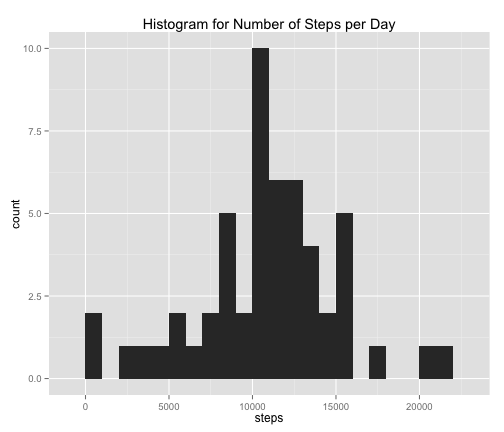
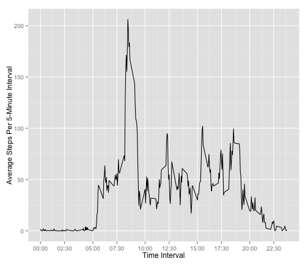
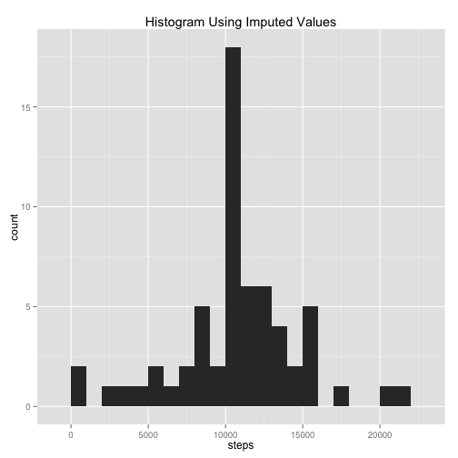
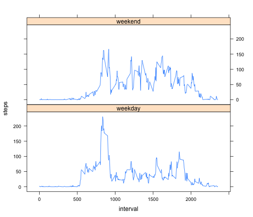
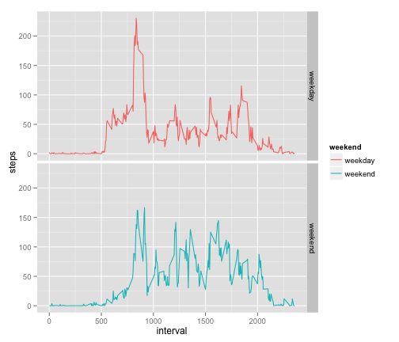

Reid's Friendly Markdown File for Knitr and General Edification
========================================================

**Instructions!**

+Please set working directory to the folder where activity.csv was downloaded. 

+Mine looks like this, but please edit this code, so it activity.csv is present in your working directory:

getwd()
setwd('./R/Coursera/reproducible/')

**Read the file**


```r
#setwd('./R/Coursera/reproducible/')
activity<-read.csv("activity.csv")
```


**Process/Transform the data (if necessary) into a format suitable for your analysis**

```r
library(plyr)


activity$date<-as.Date(activity$date)

actsum<-ddply(activity, "date", summarize, 
              steps=sum(steps),
              interval=sum(interval))

act2<-activity[complete.cases(activity),]

act2$time<-strptime((sapply(act2$interval, formatC, width = 4, flag = 0)), format = "%H%M")
act2$time <- format(act2$time,"%H:%M")

actsum2<-ddply(act2, "date", summarize, 
              steps=sum(steps),
              interval=sum(interval),
              time=max(time))

intervalsum2<-ddply(act2, "time", summarize, 
              date=mode(date),
              steps=mean(steps),
              interval=max(interval))
```


**Make a histogram of the total number of steps taken each day**


```r
library(ggplot2)
qplot(steps, data=actsum2, main='Histogram for Number of Steps per Day', binwidth=1000)
```

 

*Calculate and report the mean number of steps taken per day*


```r
mean(actsum2$steps)
```

```
## [1] 10766
```

*Calculate and report the median total of steps per day*


```r
median(actsum2$steps)
```

```
## [1] 10765
```

**What is the average daily activity pattern?**

Make a time series plot (i.e. type = "l") of the 5-minute interval (x-axis) and the average number of steps taken, averaged across all days (y-axis)


```r
qqq<-intervalsum2$time
aaa<-intervalsum2$interval
a1<-aaa[seq(1,length(aaa),30)]
q1<-qqq[seq(1,length(qqq),30)]

ggplot(data = intervalsum2, aes(interval, steps )) + geom_line() + scale_x_continuous(breaks=a1, labels=q1) + ylab("Average Steps Per 5-Minute Interval") + xlab("Time Interval")
```

 

**Which 5-minute interval, on average across all the days in the dataset, contains the maximum number of steps?**


```r
maxint<-intervalsum2$interval[which(intervalsum2$steps == max(intervalsum2$steps))]
maxtime<-intervalsum2$time[which(intervalsum2$steps == max(intervalsum2$steps))]
```

*On average, across all the days in the dataset, the maximum number of steps occurs during interval 835 or the daily time of 08:35!*


**Imputing missing values**

Note that there are a number of days/intervals where there are missing values (coded as NA). The presence of missing days may introduce bias into some calculations or summaries of the data.

Calculate and report the total number of missing values in the dataset (i.e. the total number of rows with NAs)

```r
x<-(is.na(activity$steps))
numna<-sum(x)
```

*There are 2304 NA values in the dataset.*


Devise a strategy for filling in all of the missing values in the dataset. The strategy does not need to be sophisticated. For example, you could use the mean/median for that day, or the mean for that 5-minute interval, etc.

*I employed a strategy where I impute the 5-minute interval mean.*

Create a new dataset that is equal to the original dataset but with the missing data filled in.


```r
stepmeans<-ddply(act2,~interval,summarise,mean=mean(steps))
interval<-stepmeans$interval
#datemeans<-ddply(activity,~date,summarise,mean=mean(steps))
df<-activity

for (i in 1:length(df[, 1])){
    if (is.na(df[i,1]))
        {df[i,1]<-stepmeans[which(interval==df[i,3]), 2]}
    else if (is.na(df[i,1])==FALSE)
      {df[i,1]<-df[i,1]}
         
}
```

Make a histogram of the total number of steps taken each day and Calculate and report the mean and median total number of steps taken per day. 


```r
df$time<-strptime((sapply(df$interval, formatC, width = 4, flag = 0)), format = "%H%M")
df$time <- format(df$time,"%H:%M")

dfsum2<-ddply(df, "date", summarize, 
              steps=sum(steps),
              interval=sum(interval),
              time=max(time))

qplot(steps, data=dfsum2, main='Histogram Using Imputed Values', binwidth=1000)
```

 

```r
oldmean<-mean(actsum2$steps)
oldmedian<-median(actsum2$steps)

impmean<-mean(dfsum2$steps)
impmedian<-median(dfsum2$steps)
```

*The new mean is 1.0766 &times; 10<sup>4</sup> compared to the value of `roldmean`. Similarly, the new median is 1.0766 &times; 10<sup>4</sup>, compared to the old value of 10765.*

Do these values differ from the estimates from the first part of the assignment? What is the impact of imputing missing data on the estimates of the total daily number of steps?

*The median values do not differ very much and the mean values are identical. That's probably because we were imputing mean values into the dataset.*

*This histogram is more centralizied, with more values landing on the average, whereas the tails are mostly not affected.*

**Are there differences in activity patterns between weekdays and weekends?**

For this part the weekdays() function may be of some help here. Use the dataset with the filled-in missing values for this part.

Create a new factor variable in the dataset with two levels – “weekday” and “weekend” indicating whether a given date is a weekday or weekend day.


```r
for (i in 1:length(df[, 2])){
    if (weekdays(df[i, 2])=="Saturday")
        {df$weekend[i]<-'weekend'}
    else if ((weekdays(df[i, 2])=="Sunday"))
        {df$weekend[i]<-'weekend'}
    else {df$weekend[i]<-'weekday'}
}

 dfweekend<-ddply(df,~time*weekend,summarise,
                  date=mode(date),
                  steps=format(mean(steps), scientific = NA),
                  interval=max(interval),
                  time=max(time))
```

Make a panel plot containing a time series plot (i.e. type = "l") of the 5-minute interval (x-axis) and the average number of steps taken, averaged across all weekday days or weekend days (y-axis). The plot should look something like the following, which was creating using simulated data:

```r
library(lattice)

dfweekend <- transform(dfweekend, weekend = factor(weekend))
x<-dfweekend$interval
y<-dfweekend$steps
z<-dfweekend$weekend
dfweekend$steps<-as.numeric(dfweekend$steps)


xyplot(steps~interval|weekend, data=dfweekend, type='l', layout=c(1, 2))
```

 

```r
#xyplot(steps~interval, data=intervalsum2, type='l')
#test<-dfweekend[order(dfweekend$weekend) , ]
```


*I actually like this format better*

```r
ggplot(data=dfweekend, aes(x=interval, y=steps, color=weekend))+geom_line() + facet_grid(weekend~.)
```

 
